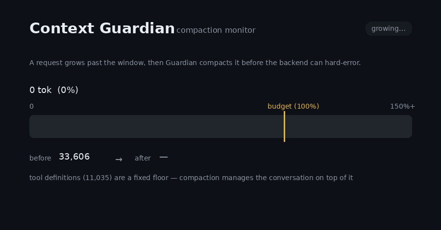
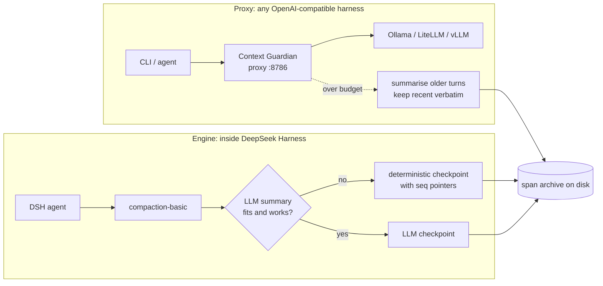

<h1 align="center">Context Guardian</h1>

<p align="center"><b>Your local-model session hits the context limit and dies. This stops that.</b></p>

<p align="center">
  
  
  
  
  
</p>

<p align="center">
  <a href="#why-this-exists">Why</a> &middot;
  <a href="#two-ways-to-run-it">Two ways to run it</a> &middot;
  <a href="#install">Install the proxy</a> &middot;
  <a href="docs/dsh-integration.md">Install in DSH</a> &middot;
  <a href="#see-it-work">See it work</a> &middot;
  <a href="CHANGELOG.md">Changelog</a>
</p>

Compaction for local models that actually fires, and never takes the conversation down with it. Two front doors, one idea: a **proxy** that sits in front of any OpenAI-compatible backend (Ollama, LiteLLM, Headroom, vLLM, LM Studio) for any CLI or agent, and a **native engine** for [DeepSeek Harness](https://github.com/deepseek-ai/deepseek-harness). Both keep the full original on disk, and both fail **open**.



*The `/guardian/health` compaction monitor: a request grows past the window, Guardian compacts it, and the session keeps going instead of hard-erroring.*

| | Without Context Guardian | With it |
|---|---|---|
| Claude-Code-style CLI on a local model | auto-compact never fires; the backend hard-rejects the request and the session is over | the proxy compacts before the window fills; the session keeps going |
| DSH on a 32K local model (measured: 314 compaction attempts) | **48 succeeded**; the rest failed on an empty summary or overflowed the window *while summarising* | every failed or impossible summary falls back to a deterministic checkpoint: ~14,012 → ~584 tokens in 23 ms, no model call |
| The part that was compacted away | gone | archived on disk; in DSH every checkpoint line carries a `seq` pointer that `recall` reads back |

## Two ways to run it

| | **Proxy** (`context_guardian.py`) | **DSH engine** (`engine.js`) |
|---|---|---|
| Works with | Claude Code, OpenClaude, anything that talks to an OpenAI-compatible `/v1/chat/completions` | [DeepSeek Harness](https://github.com/deepseek-ai/deepseek-harness) 0.1.2+ |
| How it hooks in | you point `OPENAI_BASE_URL` at it | one row in your agent preset's `compaction` group |
| Who writes the summary | the same backend model, asked by the proxy | DSH's own summariser first; a deterministic compiler when that fails, returns nothing, or cannot fit |
| Reads originals back | span archive on disk (plain JSON, one file per compaction) | `recall` / `search` tools for the model, `/recall` and `/context` for you |
| Live view | **`/guardian/health` dashboard** with the compaction monitor, `/guardian/events` | DSH's own "Context compacted" row and context meter, plus one JSON line per decision in `guardian_dsh.jsonl` |
| Compacts while idle | — | yes, above 45 % of the window |
| Archive format | `logs/guardian_spans/<run>/NNNN.json` | the same format, so the same tools read both |
| Setup guide | this README | **[docs/dsh-integration.md](docs/dsh-integration.md)** |



The rest of this page is the **proxy**. The DSH engine has its own five-minute guide: **[docs/dsh-integration.md](docs/dsh-integration.md)**.

## Why this exists

Claude-Code-style coding CLIs (Claude Code itself, and OpenAI-compatible-backend tools like OpenClaude) ship with a built-in auto-compact feature. That feature depends on accurate, real-time token-usage accounting coming back from the API in the exact shape the CLI expects. Point one of these tools at a local model through an OpenAI-compatible bridge — Ollama's `/v1` endpoint, a LiteLLM proxy, a Headroom proxy — and that accounting is frequently missing, wrong, or shaped differently, so auto-compact silently never fires.

The visible symptom: the session just runs until the backend hard-rejects the request ("token limit reached"), you're forced to close and reopen, and there's no partial-compaction attempt in between — you just lose your place.

Context Guardian is a small, deliberately simple fallback for that specific gap. It estimates the running token count itself, and once a conversation crosses a configurable threshold, it asks the *same backend* to condense the older portion of the conversation into one summary message before forwarding the request onward. Recent messages are always kept verbatim. If the summarization call itself fails, Guardian fails **open** — it forwards the original, uncompacted request rather than risk silently dropping history.

## Where it sits in your stack

This is a new link in an existing chain, not a replacement for anything you already have:

```
Your CLI / agent (Claude Code, OpenClaude, etc.)
    -> Context Guardian        (this project)
    -> your existing OpenAI-compatible backend
       (Ollama directly, a LiteLLM proxy, Headroom, vLLM, ...)
```

Point your CLI's `OPENAI_BASE_URL` at Context Guardian instead of directly at your backend, and set `GUARDIAN_UPSTREAM_URL` to wherever your backend actually lives. Guardian is a pure passthrough for everything except `POST /v1/chat/completions`, which gets the compaction check — every other route, including streaming responses, is forwarded byte-for-byte, untouched.

## If you use MCP servers or an agentic CLI, read this

Guardian counts your `tools` array against the context budget. It did not
before 0.2.0, and that was a real bug — see the changelog.

Tool definitions are usually invisible in a way message history is not. You do
not type them, they do not scroll past, and your CLI's context display often
does not break them out. But they are in every single request. On the setup this
was developed against, seven MCP servers came to **28,689 tokens — 87.6% of a
32,768-token window** — before the first user message.

**Guardian cannot compact them.** It summarizes conversation history; tool
definitions are a fixed floor underneath it. So there are two different problems
and only one of them is Guardian's:

| Problem | What fixes it |
|---|---|
| Conversation history grows until the window fills | Guardian |
| Two thirds of the window is gone before you type | Loading fewer tools, or [Tool Guardian](https://github.com/LuminariSoftwares/tool-guardian) |

Guardian will now tell you which one you have. It logs a `tool_budget` event the
first time it sees a given tool payload, and warns outright when the tool
definitions alone meet or exceed the whole window:

```
[ContextGuardian] TOOL DEFINITIONS ALONE (2671) EXCEED THE ENTIRE CONTEXT
WINDOW (1000). Nothing this proxy does can fix that -- send fewer tools.
```

If you see that, no proxy setting will help you. Most MCP-capable CLIs let you
scope which servers load per session — Claude Code and OpenClaude both accept
`--mcp-config <file>` together with `--strict-mcp-config`, which makes that file
the only source of MCP servers for the session.

**Companion project — [Tool Guardian](https://github.com/LuminariSoftwares/tool-guardian)**
(`pip install tool-guardian`) does the other half of this. It fronts your MCP servers behind three
generic tools and reveals the rest on demand, so the tool definitions stop being re-sent on every
request in the first place. Context Guardian can't compact that fixed tool floor — Tool Guardian
removes it. Use them together: **one trims the conversation, the other trims the tools.**

One consequence worth expecting: **after upgrading, Guardian compacts sooner and
more often.** It is measuring the whole request now instead of a fraction of it.
If that feels aggressive, the honest reading is that your window was already
this full and you could not see it.

## What this does *not* do

- **It doesn't replace or duplicate compression your backend already does** (e.g. Headroom, prompt caching). It forwards to your backend as-is once it's decided whether to compact first — the two are complementary, not competing.
- **It doesn't fix your CLI's own context-usage display.** Your CLI doesn't know this proxy exists, so its own token counter will drift from reality after a compaction happens. What matters is that the session keeps working instead of hard-stopping — a slightly-wrong displayed number afterward is an accepted tradeoff of doing this invisibly at the proxy layer, since the CLI itself usually isn't something you can modify.
- **It is not a tokenizer-accurate counter.** Token count is estimated from character length (~3.5 chars/token by default), not a real tokenizer, so it triggers a little early rather than late. Treat it as a safety-margin trigger, not a precise measurement.

## Install

```bash
git clone https://github.com/LuminariSoftwares/context-guardian.git
cd context-guardian
python -m venv .venv
source .venv/bin/activate   # Windows: .venv\Scripts\activate
pip install -r requirements.txt
```

Then run `python configure.py` (see [Configure](#configure) below) before starting Guardian for the first time.

## Configure

Run the interactive setup script instead of hand-editing a config file — it asks you a handful of questions about your specific hardware/backend (most importantly, your model's real context window) and writes the answers to `.env` for you:

```bash
python configure.py
```

Every question has a sensible default shown in `[brackets]` — press Enter to accept it. You can re-run `configure.py` any time to change your answers, or just edit `.env` directly afterward.

**The one setting that actually matters per-person is `GUARDIAN_NUM_CTX`.** This project was originally built and tested on a 16GB card (RTX 4070 Ti Super) running a model configured for a 32K context window — that number is specific to that hardware, not a universal default. Your correct value depends entirely on your own GPU/VRAM budget and which model you're running, so `configure.py` asks for it explicitly rather than silently assuming everyone's setup looks the same. If you're not sure what your real number is:

- **Ollama:** run `ollama ps` while your model is loaded — the `CONTEXT` column shows the live value actually in use (not necessarily the model's theoretical max).
- **LM Studio / vLLM / other servers:** check whatever context-length setting you configured when loading the model — Guardian has no way to auto-discover this, so it needs to match what you actually set.
- **If you're unsure or haven't set one explicitly:** start conservative (the `configure.py` default of 32768 is a reasonable, widely-safe starting point on a single consumer GPU) and raise it later once you've confirmed your backend can actually sustain it without running out of VRAM.

Setting this too high means Guardian won't compact soon enough and your backend can still hard-error before Guardian steps in. Setting it too low just means Guardian compacts a bit more often than strictly necessary — safe, just not optimal.

If you'd rather skip the wizard, copy `.env.example` to `.env` and edit it by hand:

```bash
cp .env.example .env
```

| Variable | Default | What it does |
|---|---|---|
| `GUARDIAN_PORT` | `8786` | Port Guardian itself listens on |
| `GUARDIAN_UPSTREAM_URL` | `http://localhost:11434/v1` | The OpenAI-compatible backend Guardian forwards to |
| `GUARDIAN_NUM_CTX` | `32768` | Your model's real context window, in tokens — keep this in sync with your actual backend/model config |
| `GUARDIAN_COMPACT_THRESHOLD` | `0.85` | Fraction of `GUARDIAN_NUM_CTX` at which compaction triggers |
| `GUARDIAN_KEEP_RECENT_MESSAGES` | `8` | Most-recent messages always kept verbatim, never summarized |
| `GUARDIAN_CHARS_PER_TOKEN` | `3.5` | Characters-per-token used for the estimate |
| `GUARDIAN_COUNT_TOOLS` | `1` | Count the `tools` array against the budget. Set `0` for pre-0.2.0 messages-only behaviour |
| `GUARDIAN_UPSTREAM_TIMEOUT` | `600` | Seconds to wait for the upstream backend to respond |
| `GUARDIAN_UPSTREAM_CONNECT_TIMEOUT` | `10` | Seconds to wait for the upstream connection itself |
| `GUARDIAN_LOG_PATH` | `<repo>/logs/context_guardian_log.json` | Where compaction events are logged (JSON lines) |
| `GUARDIAN_HOST` | `127.0.0.1` | Interface Guardian binds. **Leave this alone unless you know what you are doing** — Guardian fronts your backend with no authentication |
| `GUARDIAN_RESERVE_OUTPUT` | `8192` | Tokens held back for the model's *output*. The window has to hold the reply and (for reasoning models) the thinking too, so compaction triggers against what is LEFT. If this is ever ≥ `GUARDIAN_NUM_CTX` it is clamped to half the window and logged — fix the config |
| `GUARDIAN_SPAN_DIR` | `<repo>/logs/guardian_spans` | Where evicted messages are archived before folding. This is what makes compaction lossless on disk |
| `GUARDIAN_KEEP_SPANS` | `500` | How many span files to keep. `0` keeps none |
| `GUARDIAN_KEEP_SUMMARIES` | `1` | How many of Guardian's own previous summaries stay in the window. Retired ones are folded into the next span, not discarded |
| `GUARDIAN_MIN_SUMMARY_CHARS` | `40` | A summary shorter than this is treated as a FAILED summarisation and nothing is evicted. See 0.4.0 in the changelog for why this exists |
| `GUARDIAN_MIN_TRANSCRIPT_CHARS` | `80` | If the messages being evicted render to less than this, Guardian refuses to summarise rather than summarising nothing |
| `GUARDIAN_TOOL_ARG_CHARS` | `300` | How much of a tool call's arguments reaches the summariser. The full text is in the span |
| `GUARDIAN_SUMMARY_REASONING_EFFORT` | unset | Passed as `reasoning_effort` on the summarisation call only. Non-standard, so off by default; `low` roughly halved summarisation latency on gpt-oss |
| `GUARDIAN_VERBOSE` | `1` | Print a visible multi-line banner on every compaction (what it cut, tokens before/after, tokens saved). Set `0` for the old single-line log entry |
| `GUARDIAN_COST_PER_1M_INPUT_USD` | `0` | Price of 1M input tokens on the hosted API you're *avoiding* by running locally. When set, Guardian reports the running dollar value of the tokens compaction has kept you from re-sending. `0` (default) omits the cost line — you're on a local model, there's no real bill |
| `GUARDIAN_VERSION_CHECK` | `1` | On startup, ask PyPI once (2s timeout, cached 24h, fully fail-open) whether a newer `context-guardian` exists and print one line if so. Set `0` to disable — airgapped/privacy setups never touch the network |
| `GUARDIAN_VERSION_CACHE` | `<repo>/logs/.version_check_cache.json` | Where the update check caches PyPI's answer so frequent restarts don't re-hit the network (24h TTL) |

**A note on timeouts:** local "thinking"/reasoning models can go silent for a long time before their first output token. If you see `500` errors appear only on real (non-trivial) requests after a long pause, raise `GUARDIAN_UPSTREAM_TIMEOUT` before assuming something is broken — the default 5-second timeout most HTTP clients ship with is sized for ordinary REST APIs, not local LLM inference, which is exactly the bug this project's own commit history caught during development.

## Run

```bash
python context_guardian.py
```

Then point your CLI's `OPENAI_BASE_URL` at `http://localhost:8786/v1` (or whatever port you configured).

## Testing before you trust it with a real session

1. Start your real backend (Ollama, LiteLLM, Headroom, whatever you use) the way you normally would.
2. Start Guardian: `python context_guardian.py`
3. Send one manual request at it instead of your real CLI, to confirm plain passthrough works before testing compaction specifically:
   ```bash
   curl http://localhost:8786/v1/chat/completions \
     -H "Content-Type: application/json" \
     -d '{"model":"<your-model>","messages":[{"role":"user","content":"say hi"}]}'
   ```
4. Check `GET http://localhost:8786/guardian/stats` for the running token estimate and compaction count — or open `http://localhost:8786/guardian/health` in a browser for the live dashboard (window usage, compactions, tokens/cost saved, and any update notice), which just renders that same JSON on a 3-second refresh.
5. Force a compaction test: temporarily set `GUARDIAN_NUM_CTX` and `GUARDIAN_COMPACT_THRESHOLD` low (e.g. `NUM_CTX=2000`, `THRESHOLD=0.5`), then send a conversation with several long messages. Confirm a compaction log entry appears at `GUARDIAN_LOG_PATH` and the request that actually reaches your backend is smaller than what was sent in.
6. Only after that, point your CLI's `OPENAI_BASE_URL` at Guardian and test with a real session.

## Running multiple models with different context windows

Guardian's `GUARDIAN_NUM_CTX` is fixed for the lifetime of one running instance. If you switch between models with meaningfully different context windows, either:

- run a second Guardian instance on a different `GUARDIAN_PORT` with its own `GUARDIAN_NUM_CTX`, or
- keep one instance and accept that its threshold is tuned to whichever model has the smaller/more-constrained window (safer than the alternative, since it just means Guardian compacts a bit earlier than strictly necessary for the larger-window model).

## Development / running tests

```bash
pip install -r requirements-dev.txt
pytest
```

## See it work

- **Proxy:** open `http://localhost:8786/guardian/health` while a session runs. The compaction monitor replays every compaction as a before → after bar, with a per-compaction dropdown and an advice box when your fixed floor (tools + system prompt) is the real problem. `GET /guardian/events` returns the same records as JSON.
- **DSH:** type `/context` in a session for pressure, cache hits and what compacting now would save; `/recall 3-7`, `/recall result 42` or `/recall find <text>` to read originals; `logs/guardian_dsh.jsonl` for the decision trail (`idle-check` → `compaction/start` → `deterministic` or `llm` → `compaction/end`).

## Acknowledgements

Context Guardian stands on other people's ideas, and says so:

- **[dsh-compaction-instant](https://www.npmjs.com/package/dsh-compaction-instant)** (TsFreddie, MIT) — `vendor/compiler.js` and `vendor/region.js` are vendored **unmodified** from 0.1.4, with their original headers and the MIT licence text in [`vendor/LICENSE.dsh-compaction-instant`](vendor/LICENSE.dsh-compaction-instant). The `recall` / `search` contract follows theirs.
- **[VCC](https://github.com/lllyasviel/VCC)** (lllyasviel) — the conversation-compiler principle that compiler ports: compile the log into a compact view made only of original tokens, with a pointer back to every elided part.
- **[dsh-openwolf](https://github.com/hawk2048/dsh-openwolf)** (MIT) — the idea of snapshotting session state right before a compaction. The engine's `precompact-<seq>.json` and the `FILES WRITTEN` list are an independent implementation of that idea; no openwolf code is included.
- **[DeepSeek Harness](https://github.com/deepseek-ai/deepseek-harness)** — `summarize()` is the hook its compaction engine documents for exactly this.

Full third-party notices: [THIRD_PARTY_NOTICES.md](THIRD_PARTY_NOTICES.md).

## License

MIT — see [LICENSE](LICENSE).
